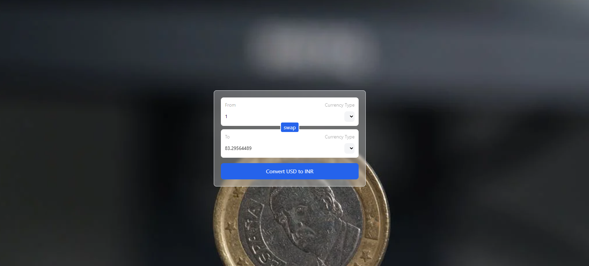

## Currency Converter React App

This React application is a currency converter that allows users to input an amount and select a currency type for conversion. The app utilizes custom hooks, the Fetch API, useState hook, and useId hook for managing state, fetching data, and generating unique identifiers respectively.

### Features:
- Currency Selection: Users can select the currency type for conversion.
- Custom Hooks: Utilizes custom hooks for managing state and generating unique identifiers.
- Fetch API: Fetches currency conversion data from an external API for real-time conversion.

### Learnings:
- **Custom Hooks:** Understanding and implementing custom hooks to encapsulate stateful logic and reuse it across components.
- **Fetch API:** Utilizing the Fetch API to make asynchronous requests for fetching data from external APIs.
- **useState Hook:** Leveraging the useState hook to manage component-level state for dynamic rendering and data manipulation.
- **useId Hook:** Usage of the useId hook to generate unique identifiers for HTML elements, ensuring accessibility and avoiding duplicate IDs.

### Preview:
[//]: # (Add preview command here)

### How to Download and Use:
1. Clone the repository to your local machine.
2. Navigate to the project directory.
3. Install dependencies using `npm install`.
4. Run the development server using `npm run dev`.
5. Open your web browser and visit the provided localhost address to access the application.

**Creator:** Vishal Pandey
